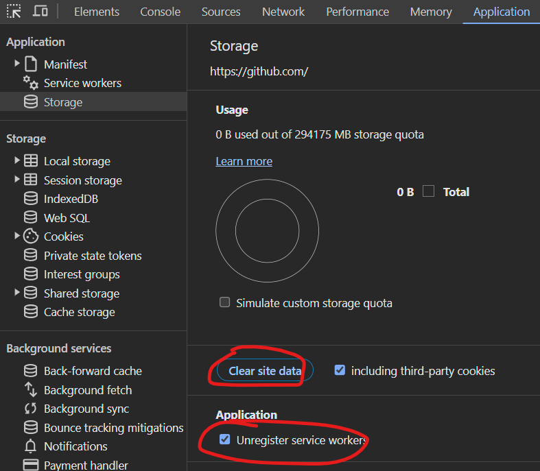

# ARK Starters Single Page Application

## Introduction

In this project, we've curated a collection of UI elements, layouts, and interactions to demonstrate best practices in user interface design. Each section focuses on a specific aspect of UI.

### Packages

In order to mantain this project with the most updated version of LTS's packages:

Run `npm outdated` to see a table of packages with the current version, wanted version, and latest version.

To update a specific package, you can use `npm update package_name` This will update the package to the 'wanted' version, which is the maximum version that satisfies the versioning range specified in package.json.

In order to Update all packages you can also use the command `npx npm-check-updates` that upgrades your package.json dependencies to the latest versions, ignoring specified versions.

## Features

- **Flexible Authentication Provider:** This project include the authentication provider library that supports multiple authentication providers. You can easily support the providers you need.
- **Diverse Examples:** From simple buttons to complex navigation menus, the project covers a wide range of UI elements commonly found in web and mobile applications.
- **Accessible Components:** Explore implementations that prioritize accessibility, making your UIs inclusive and usable for everyone.
- **Code Snippets:** Each example comes with corresponding code snippets, making it easy for developers to integrate these UI patterns into their projects.
- **Localization:** based on i18next and [vscode i18n-ally](https://github.com/lokalise/i18n-ally) extension, supports dynamic loading of translation files and auto-detect based on Browser

## Getting Started

TODO: this section would provide examples on how to run the template and how to use it

### Running and Testing

#### Development Server

To start the development server:

```bash
npm start
```

This will:
- Start the connectionStrings server on port 4000
- Start the Vite dev server on port 3000
- Open your browser automatically

#### E2E Tests

To run end-to-end tests:

```bash
npm run test
```

This will:
- Start the connectionStrings server on port 4001
- Start the Vite dev server on port 3001 with coverage instrumentation
- Run Cypress tests in headless mode
- Generate coverage reports

**Note:** E2E tests use different ports (3001, 4001) than development (3000, 4000), allowing you to run tests concurrently with the dev server.

#### Interactive E2E Testing

For interactive test development:

```bash
npm run e2e:start
```

This opens the Cypress UI for interactive test running and debugging.

#### Performance Notes

E2E tests now use the Vite development server instead of building the application, which provides:
- **~90s faster** test execution (no build step required)
- Better debugging with source maps
- Faster feedback loop during development

For detailed information about the e2e test performance migration, see [E2E Performance Migration](docs/E2E_PERFORMANCE_MIGRATION.md).

### Design Guidelines

When styling components, we follow these guidelines:

#### Support for Light and Dark mode

The application supports natively both light and dark mode.
The way this works is that chackra save a variable in the localStorage with either 'Light' or 'Dark'.
On a deployed environment this do not rapresent any problem but, locally, having multiple chackra projects could mess with this setting and leading to unwanted bheaviour such as having the swith reversed (having light theme when Dark mode is selected).
To avoid this ensure to set a custom name to this variable in the **index.tsx** file:

```typescript
const colorModeManager = createLocalStorageManager("appName-ColorMode");
```

and then pass it in the **Provider**:

```jsx
<ChakraProvider  theme={theme}  colorModeManager={colorModeManager}>
```

#### Z-Index usage

For any need of z-Index, we refer to the zIndices guideline of Chackra UI

the only accepted values for any zIndex property across the project would be one of the followings:

```typescript
const zIndices = {
  hide: -1,
  auto: "auto",
  base: 0,
  docked: 10,
  dropdown: 1000,
  sticky: 1100,
  banner: 1200,
  overlay: 1300,
  modal: 1400,
  popover: 1500,
  skipLink: 1600,
  toast: 1700,
  tooltip: 1800,
};
```

#### Distancing

1. **Use `em` units for font sizes and other measurements related to text**: This makes the design more flexible and accessible, as `em` units adjust automatically to the user's default font size. For example, instead of `fontSize="16px"`, use `fontSize="1em"`.

2. **Use `px` units for margins and padding**: These measurements are often not related to text size, so it's okay to use `px` units for them. For example, `mx="5px"`.

Remember to test your design at different browser font sizes to make sure it looks good and is easy to read for all users.

#### Tables

Tables are implemented with Tanstack (react tables v8)

In the template there is a component (PaginatedSortableTable) ready for the most common use, completely compatible with standard ARK APIs.

**Ex:**

```jsx

<PaginatedSortableTable<T>
columns={columns}
useQueryHook={useGetMoviesQuery}
isDraggable
/>

```

**Props:**

```Typescript

type  PaginatedSortableTableProps<T>  =  {
  columns:  ColumnDef<T>[];
  useQueryHook: ( args: {
    pageIndex:  number;
    pageSize:  number;
    sorting:  SortingState;
    filters:  ColumnFiltersState;
  })  =>  any;
  isDraggable?:  boolean;
  disableHeaderFilters?:  boolean;
  externalFilters?:  boolean;
  externalFiltersState?:  ColumnFiltersState;
};

```

**columns:** an Array of ColumnDef<T> that specify the columns with all the props needed (see Tanstack docs)

**useQueryHook:** The query hook generated by your Redux Toolkit Query API for fetching table data that should return an object like this

```js
data: {
  data: retData.data,
  count: retData.count,
  page: page,
  limit: pageSize,
}
```

**isDraggable:** Enables column sorting trough drag & drop

**disableHeaderFilters:** this remove all the column headers filters (if you dont want to specify all _false_ in the **columns** array

**externalFilters:** this enable the use of external filters (external means that filters are not in the columns header)

**externalFiltersState:** _ColumnFiltersState_ object with the state of external filters (this is mandatory if **externalFilters** is true

### Environment (env)

The application initializes itself by reading environmental variables and injecting them into the Redux store (env). Additionally, the Authentication provider constructor receives _env_ as a parameter, containing all the necessary configurations.
_env_ is an object of type **AppSettingsType** defined as it follows:

```typescript
type AppSettingsType = {
  clientID: string;
  domain: string;
  scopes: string;
  knownAuthorities: string;
  signUpSignInPolicyId: string;
  serviceUrl: string;
  redirectUri: string;
  authority: string;
  audience: string;
};
```

This will be used as globals configuration and can be implemented to support more features (ex: subsidiaries).

### Authentication

This project supports multiple authentication providers through a flexible interface:
- **MSAL** (Microsoft Authentication Library) for Azure AD B2C
- **Auth0** for Auth0 authentication  
- **NoopAuthProvider** for development/testing without authentication

#### Selecting Your Authentication Provider

**Important for Bundle Size Optimization:** Only ONE auth provider should be active to minimize bundle size. The inactive provider will be automatically excluded by tree-shaking.

**To select your authentication provider:**

1. Open `src/config/authProvider.ts`
2. Choose ONE of the following configurations by commenting/uncommenting the appropriate sections:

**Option 1: MSAL (Azure AD B2C) - Default**
```typescript
// MSAL - ACTIVE
import { NoopAuthProvider, AuthProvider } from "../lib/authentication/providers/authProviderInterface";
import { MsalAuthProvider } from "../lib/authentication/providers/msalAuthProvider";
import { appSettings } from "./env";

export const authProvider: AuthProvider = appSettings.msal
  ? new MsalAuthProvider({
      ...appSettings.msal,
      permissionsClaims: ["extension_Scope"],
    })
  : new NoopAuthProvider();

// Auth0 - COMMENTED OUT
/*
import { Auth0AuthProvider } from "../lib/authentication/providers/auth0AuthProvider";
...
*/
```

**Option 2: Auth0**
```typescript
// MSAL - COMMENTED OUT
/*
import { MsalAuthProvider } from "../lib/authentication/providers/msalAuthProvider";
...
*/

// Auth0 - ACTIVE
const claimsUrl = "http://ark-energy.eu/claims/";
import { Auth0AuthProvider } from "../lib/authentication/providers/auth0AuthProvider";
import type { AuthProvider } from "../lib/authentication/providers/authProviderInterface";
import { appSettings } from "./env";

export const authProvider: AuthProvider = new Auth0AuthProvider({
  ...appSettings,
  permissionsClaims: [claimsUrl + "permissions", claimsUrl + "groups"],
});
```

**Option 3: No Authentication (Development)**
```typescript
import { NoopAuthProvider } from "../lib/authentication/providers/authProviderInterface";
export const authProvider = new NoopAuthProvider();
```

**Bundle Size Impact:**
- **Active provider only:** ~60-70 KB gzipped (MSAL or Auth0)
- **Unused providers:** 0 KB (automatically excluded by tree-shaking)
- **Total savings:** ~60-70 KB by ensuring unused providers are commented out

#### Provider-Specific Configuration

This project supports **MSAL** and **Auth0** providers and you can switch between one another easily.
This is how:

1. Go to the **src/config/authProvider.ts** file
2. Comment out the unused provider and uncomment your chosen provider
3. Configure environment variables for your chosen provider

_env_ is the environment and it must contain all the data needed to authenticate with the provider (all details in the specific implementations below).
For this reason make sure that the **connectionStrings.cjs** file (or **public/connectionStrings.cjs**) is aligned with the deploy environments you are using.
In order to make this work locally you must create a **.env.local** file in the root of your project with all the env variables needed by connectionStrings.cjs and your AuthProvider implementation.

#### Auth0

##### .env.local

```javascript
AUTH0_ClientId = "yourclientId";
AUTH0_Domain = "yourDomain";
AUTH0_Audience = "https://yourAudience.auth0.com/api/v2/";
AUTH0_RedirectUri = "yourRedirectUri";
SERVICE_URL = "yourApi.com";
```

##### connectionStrings.cjs

```javascript
var http = require("http");
var port = process.env.port;
if (process.env.NODE_ENV === "development") {
  require("dotenv").config({ path: ".env.local" });
}
http
  .createServer(function (req, res) {
    res.writeHead(200, { "Content-Type": "text/javascript" });
    res.end(`
  window.appSettings = {
  clientID: "${process.env["AUTH0_ClientId"]}",
  domain: "${process.env["AUTH0_Domain"]}",
  audience: "${process.env["AUTH0_Audience"]}",
  redirectUri: "${process.env["AUTH0_RedirectUri"]}",
  serviceUrl: "${process.env["SERVICE_URL"]}",
  };
 `);
  })
  .listen(port);
```

#### MSAL

##### .env.local

```javascript
PORT = 4000;
MSAL_ClientId = "yourclientId";
MSAL_Domain = "yourDomain";
MSAL_Scopes = "YourScopes";
MSAL_knownAuthorities = "yourKnownAutorities";
MSAL_authority = "YourMsalAutority";
MSAL_RedirectUri = "yourRedirectUri";
SERVICE_URL = "yourApi.com";
```

##### connectionStrings.cjs

```javascript
var http = require("http");
var port = process.env.port;
if (process.env.NODE_ENV === "development") {
  require("dotenv").config({ path: ".env.local" });
}
http
  .createServer(function (req, res) {
    res.writeHead(200, { "Content-Type": "text/javascript" });
    res.end(`
  window.appSettings = {
  clientID: "${process.env["MSAL_ClientId"]}",
  domain: "${process.env["MSAL_Domain"]}",
  scopes: "${process.env["MSAL_Scopes"]}",
  authority:"${process.env["MSAL_authority"]}",
  knownAuthorities:"${process.env["MSAL_knownAuthorities"]}",
  redirectUri: "${process.env["MSAL_RedirectUri"]}",
  serviceUrl: "${process.env["SERVICE_URL"]}",
  };
 `);
  })
  .listen(port);
```

#### Adding providers

In order to add support for more providers you will implement your own version of the AuthProvider interface.
Here is the interface:

```typescript
export interface AuthProvider {
  /**
   * Initializes the authentication module with configuration data,
   * typically fetched from Azure, and stores it in the Redux store.
   */
  init: () => Promise<void>;
  /**
   * Initiates the login process.
   */
  login: () => void;
  /**
   * Initiates the logout process.
   */
  logout: () => void;
  /**
   * Retrieves the authentication token information
   * if token is not valid token will be refreshed silently
   * @returns The authentication token information.
   */
  handleLoginRedirect: () => Promise<void>;
  getToken: (audience?: string) => TokenResponse;
  /*
   * Checks whether the current user has the specified permission.
   *
   * @param permission - The permission to check.
   * @returns true if the user has the permission, false otherwise.
   */
  hasPermission: (permission: string, audience?: string) => boolean;
  /**
   * Provides information about the current login status,
   * including whether the authentication process is loading, any data retrieved,
   * and any encountered errors.
   */
  getLoginStatus: () => LoginStatus;
  /**
   * Provides information about the current token retrieval status,
   * including whether the process is loading, any data retrieved,
   * and any encountered errors.
   */
  getUserDetail: () => Promise<UserAccountInfo | null>;
}
```

### Localization with i18n

[React-i18next](https://react.i18next.com/) is used for Localization support. Refer to official documentation for usage or check the [LocalizationPage](src/features/localization/localizationPage.tsx) examples.

#### Configure

Edit [config/lang.ts](https://github.com/ARKlab/Ark.Starters.SPA/blob/master/src/config/lang.ts) configuring the list of supported Locales and the respective title, which will be shown in the LocaleSwitcher in the Header.

To disable Localization but still supporting Zod errors, fill the list with the only supported lang.

#### Integration with Zod validation error

Based on [zod-i18n-map](https://github.com/aiji42/zod-i18n), has been configured so that you can use zodCustom i18n namespace for custom key messages as shown in [LocalizationPage](src/features/localization/localizationPage.tsx).

```ts
const TestSchema = z.object({
  name: z.string().min(6),
  fieldName: z.string().email(),
  customErrorInline: z.number().refine(x => x < 3, {
    params: {
      i18n: { key: "custom_error" },
    },
  }),
});
```

```json
{
  "custom_error": "This is a custom message."
}
```

#### Integration with React hook form

Check [LocalizationPage](src/features/localization/localizationPage.tsx) to see how to use Zod for validating the Forms using `zod2FormValidator` and `zod2FieldValidator` helpers.

### PWA Support

This starter project include PWA via [vite-plugin-pwa](https://github.com/vite-pwa/vite-plugin-pwa).

#### Test PWA Update badge

To test the PWA popup, run the preview build.

1. npm run build
2. npm run preview
3. Ctrl+C to stop the Preview server - leave the page open in the Browser
4. edit any file
5. npm run build
6. npm run preview
7. A wild Popup happears!
8. **Remember to uninstall the Service Worker** by clearing site data from DevTools before moving back to development via `npm run start`



### Cookie Consent

By default this Template adds a Cookie Consent banner. By choice, the Banner is blocking and the entire site is blocked until user picks a choice.

The Template uses technical 'Cookies' by default to provide the following 'necessary' capabilities (Cookies include any storage, including LocalStorage, SessionStorage, WorkersCache, etc.):

- _lang_: used to provide Lang switch so that User can also Read the ToS.
- _dark theme_: used to use the _system_ configured theme. This is arguably a 'functional' cookie more than 'necessary' but is embeeded in Chakra UI. Check [this](https://github.com/themesberg/flowbite-react/issues/546) discussion.
- _auth_: authentication libraries like MSAL and Auth0 use cookies for login purposes. Check the respective website for the list of cookies used.

#### Configure

Edit [`config/gdpr.ts`](./src/config/gdpr.ts) file.

#### Limitations

Only 'external' policy urls are supported as the ConsentBanner is blocking and thus would not redirect. Use the Translation files to embeed the Policy within the description of the Customize.
